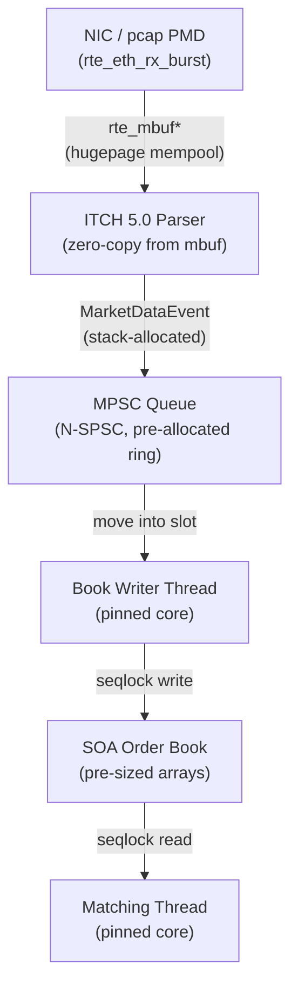

# low-latency-feed-handler

C++23 low-latency feed handler — DPDK pcap PMD, NASDAQ ITCH 5.0 parser, zero-copy mbuf pipeline, MPSC market data aggregation into SOA order book. Zero heap allocation end-to-end.

## Status

Architecture documented. Meson build scaffold in place. ITCH parser in progress.

## Build

**Dependencies**

| Dependency | Version | Install |
|---|---|---|
| GCC | 13.3.0 | system |
| Meson | ≥ 1.3 | `sudo apt install meson ninja-build` |
| DPDK | 23.11.x | `sudo apt install dpdk-dev` |
| GTest | any | `sudo apt install libgtest-dev` |
| Google Benchmark | any | `sudo apt install libbenchmark-dev` |

`low-latency-order-book` headers are vendored under `subprojects/low-latency-order-book/include/llob/` — no separate install required (see [ADR-006](docs/adr/ADR-006-mpsc-order-book-subproject.md)).

**Configure and build**

```bash
meson setup build
cd build && ninja
```

Tests and benchmarks are enabled by default. Disable if GTest/GBench are not installed:

```bash
meson setup build -Denable_tests=false -Denable_benchmarks=false
```

**Development (pcap PMD)**

```bash
./feed-handler --vdev net_pcap0,rx_pcap=itch.pcap -l 2,4,6
```

See [ADR-003](docs/adr/ADR-003-pcap-pmd-development.md) for pcap PMD scope and limitations.

## Intended Architecture



Zero heap allocation end-to-end. Each stage uses a pre-allocation strategy
declared at startup — `rte_mempool` for the NIC boundary, ring slots for the
queue, fixed arrays for the book. See [ADR-002](docs/adr/ADR-002-zero-heap-allocation.md).

## Architecture Decision Records

| ADR | Title | Status |
|-----|-------|--------|
| [ADR-001](docs/adr/ADR-001-why-dpdk.md) | Why DPDK — Kernel UDP Jitter via IRQs, sk_buff, RCU | Accepted |
| [ADR-002](docs/adr/ADR-002-zero-heap-allocation.md) | Zero Heap Allocation End-to-End | Accepted |
| [ADR-003](docs/adr/ADR-003-pcap-pmd-development.md) | pcap PMD for Development — PMD-Agnostic Application Design | Accepted |
| [ADR-004](docs/adr/ADR-004-itch-message-type-selection.md) | ITCH 5.0 Message Type Selection | Accepted |
| [ADR-005](docs/adr/ADR-005-rte-mbuf-zero-copy-parsing.md) | rte_mbuf Zero-Copy Parsing Boundary | Accepted |
| [ADR-006](docs/adr/ADR-006-mpsc-order-book-subproject.md) | MPSC Integration from low-latency-order-book Subproject | Accepted |
| [ADR-007](docs/adr/ADR-007-benchmark-methodology.md) | Benchmark Methodology — TSC Timing, Tail Latency, Environment | Accepted |
