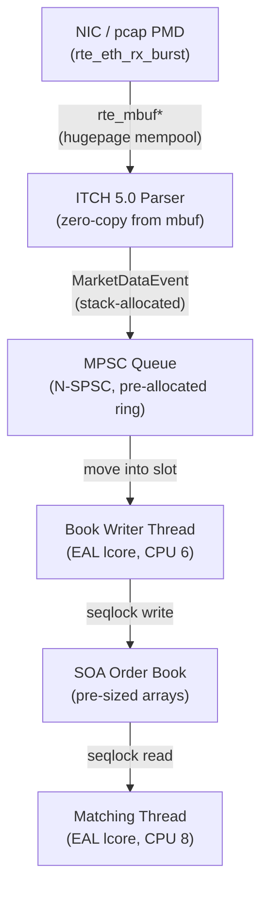

# low-latency-feed-handler

C++23 low-latency feed handler — DPDK pcap PMD, NASDAQ ITCH 5.0 parser, zero-copy mbuf pipeline, MPSC market data aggregation into SOA order book. Zero heap allocation end-to-end.

## Status

ITCH 5.0 Add Order parser, MoldUDP64 unwrapper, and full DPDK pipeline (`src/main.cpp`) implemented and compiling clean. GBench compute-floor benchmarks and Cachegrind cache profiling complete. See [Benchmark Results](#benchmark-results) below.

## Build

**Dependencies**

| Dependency | Version | Install |
|---|---|---|
| GCC | 13.3.0 | system |
| Meson | ≥ 1.3 | `sudo apt install meson ninja-build` |
| DPDK | 23.11.x | `sudo apt install dpdk-dev` |
| GTest | any | `sudo apt install libgtest-dev` |
| Google Benchmark | any | `sudo apt install libbenchmark-dev` |

`low-latency-order-book` headers are vendored under `subprojects/low-latency-order-book/include/llob/` — no separate install required (see [ADR-006](docs/adr/ADR-006-mpsc-order-book-subproject.md)).

**Configure and build**

```bash
meson setup build
cd build && ninja
```

Tests and benchmarks are enabled by default. Disable if GTest/GBench are not installed:

```bash
meson setup build -Denable_tests=false -Denable_benchmarks=false
```

**Development (pcap PMD)**

```bash
./feed-handler --vdev net_pcap0,rx_pcap=itch.pcap -l 2,4,6
```

See [ADR-003](docs/adr/ADR-003-pcap-pmd-development.md) for pcap PMD scope and limitations.

## Intended Architecture



Zero heap allocation end-to-end. Each stage uses a pre-allocation strategy
declared at startup — `rte_mempool` for the NIC boundary, ring slots for the
queue, fixed arrays for the book. See [ADR-002](docs/adr/ADR-002-zero-heap-allocation.md).

## Architecture Decision Records

| ADR | Title | Status |
|-----|-------|--------|
| [ADR-001](docs/adr/ADR-001-why-dpdk.md) | Why DPDK — Kernel UDP Jitter via IRQs, sk_buff, RCU | Accepted |
| [ADR-002](docs/adr/ADR-002-zero-heap-allocation.md) | Zero Heap Allocation End-to-End | Accepted |
| [ADR-003](docs/adr/ADR-003-pcap-pmd-development.md) | pcap PMD for Development — PMD-Agnostic Application Design | Accepted |
| [ADR-004](docs/adr/ADR-004-itch-message-type-selection.md) | ITCH 5.0 Message Type Selection | Accepted |
| [ADR-005](docs/adr/ADR-005-rte-mbuf-zero-copy-parsing.md) | rte_mbuf Zero-Copy Parsing Boundary | Accepted |
| [ADR-006](docs/adr/ADR-006-mpsc-order-book-subproject.md) | MPSC Integration from low-latency-order-book Subproject | Accepted |
| [ADR-007](docs/adr/ADR-007-benchmark-methodology.md) | Benchmark Methodology — TSC Timing, Tail Latency, Environment | Accepted |
| [ADR-008](docs/adr/ADR-008-lcore-threading-model.md) | EAL Lcore Threading Model | Accepted |

## Benchmark Results

### Methodology

**What these benchmarks measure — and what they don't.**

These are *compute-floor* benchmarks: single-threaded, cache-hot, contention-free. They answer the question *"what is the minimum possible latency of this hot path?"* — not what latency looks like in production under concurrent load.

**Why RDTSC, not GBench wall time.** GBench reports mean latency across millions of iterations. Mean is irrelevant for HFT — a strategy cares about the worst-case latency per message, because a single slow iteration is a fill at the wrong price. RDTSC timestamps each iteration individually; the resulting distribution gives P50, P99.9, and P99.99, which are the operationally meaningful metrics.

**Why performance governor.** The default `powersave` governor allows the CPU to drop to its base clock mid-benchmark. RDTSC cycles are then converted to nanoseconds using a TSC calibration taken at startup — if the clock changes between calibration and the hot loop, the ns conversion is wrong. Locking to `performance` keeps TSC frequency stable.

**Why Cachegrind uses a separate driver.** `__rdtsc()` returns 0 under Valgrind. The static TSC calibration then produces `+inf` ns/cycle, which propagates NaN through `std::vector<double>` and causes `std::sort` UB — Valgrind exits silently with no output. `cachegrind_driver.cpp` runs the identical hot path without RDTSC, so Cachegrind can instrument cleanly.

### Running

```bash
# Compute-floor benchmark (lock governor first)
sudo sh -c 'echo performance | tee /sys/devices/system/cpu/cpu*/cpufreq/scaling_governor'
./build/benchmarks/pipeline_bench --benchmark_counters_tabular=true --benchmark_min_time=2s
sudo sh -c 'echo powersave | tee /sys/devices/system/cpu/cpu*/cpufreq/scaling_governor'

# Cache and branch profile
valgrind --tool=cachegrind --cache-sim=yes --branch-sim=yes ./build/benchmarks/cachegrind_driver
```

### Results

Measured on Intel Core i5-12400 (6P-core, 12-thread), GCC 13.3.0 `-O3 -march=native`, CPU governor locked to `performance`.

| Benchmark | What it measures | P50 | P99.9 | P99.99 |
|---|---|---|---|---|
| `BM_ParseDirect` | `parse_add_order` only | 5.6 ns | 7.6 ns | 8.0 ns |
| `BM_UnwrapParse` | MoldUDP64 unwrap + parse | 6.4 ns | 14.0 ns | 50.1 ns |
| `BM_Pipeline` | unwrap + parse + `order_book.add` | 29.2 ns | 44.9 ns | 67.3 ns |

MoldUDP64 unwrap overhead: **~0.8 ns** at P50 (BM_UnwrapParse − BM_ParseDirect).  
`order_book.add` overhead: **~21 ns** at P50 (BM_Pipeline − BM_UnwrapParse).  
P100 values (µs range) are OS scheduler jitter — suppressed in production with `isolcpus` + `nohz_full`.

### Cache profile (Cachegrind, 100k hot-path iterations)

```
D1  miss rate:  0.0%   — entire hot path fits in 48 KiB L1 data cache
LL  miss rate:  0.0%   — zero last-level cache misses at steady state
Branch mispredict: 2.5% — std::lower_bound on bid array; improves with real price distribution
```

The SOA order book layout is validated: no cache misses in the write path at steady state. The 21 ns `order_book.add` cost is entirely branch mispredictions from `lower_bound`, not memory traffic.

### Why concurrent matching is not benchmarked here

The matching thread reads the order book via a seqlock; the book writer thread writes it. This is already benchmarked in the companion repo [`low-latency-order-book`](https://github.com/alchevrier/low-latency-order-book).

`BM_MatchingConcurrent` pins a continuous writer to CPU6 and measures `best_bid()` reads from CPU4 under real cross-core coherency pressure. However, GBench computes the mean of 100 iterations per repetition and then derives P99.9 from those 1000 per-repetition means — not from individual calls. A single 500 ns spike in a batch of 100 iterations contributes only 5 ns to the mean, so the tail is systematically suppressed. The reported P99.9 of 26.7 ns (CPU time) is the 99.9th percentile of batch averages, not of real per-call latency.

`bench_rdtsc` fixes this by using RDTSC to timestamp every individual call — the same methodology used in the feed handler benchmarks here. The true per-call distribution is:

| Scenario | P50 | P99 | P99.9 |
|---|---|---|---|
| Isolated (no writer) | ~9.6 ns | ~10.4 ns | ~14.4 ns |
| Concurrent (writer on CPU6) | ~95 ns | ~3.4 µs | ~6.3 µs |

The concurrent P99.9 is **6.3 µs**, not 26.7 ns — a 230× difference that averaging completely hides. This is the real seqlock cost under continuous cross-core write pressure.

The feed handler benchmarks here focus exclusively on the write-path compute floor: parsing throughput and `order_book.add` cost. The full NIC-to-book end-to-end measurement — combining both paths under real concurrent load — remains future work, requiring a TSC-instrumented multi-lcore DPDK run with a real ITCH feed driving the writer.
